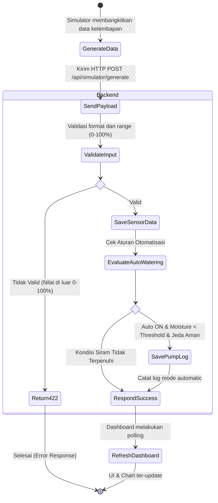
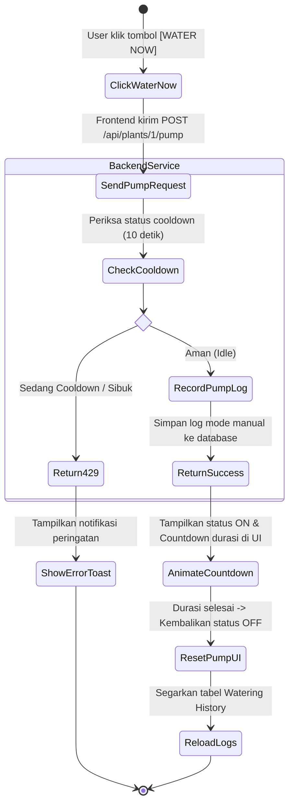

# Activity Diagram - Smart Plant IoT

Dokumen ini memodelkan alur aktivitas sistem untuk dua proses utama: Ingestion Data & Evaluasi Penyiraman Otomatis, serta Penyiraman Manual.

---

## 1. Alur Aktivitas: Ingestion Data Sensor & Evaluasi Otomatis

---

## 2. Alur Aktivitas: Penyiraman Manual (Manual Watering)

