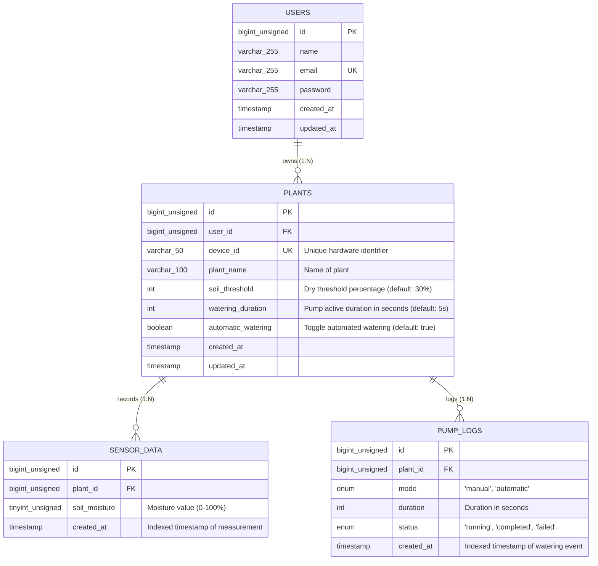

# Entity Relationship Diagram (ERD) - Smart Plant IoT

Dokumen ini menjelaskan struktur data konseptual, entitas, atribut, dan kardinalitas relasi database pada sistem Smart Plant.

---

## 1. Diagram ERD (Crow's Foot Notation)

---

## 2. Deskripsi Relasi & Kardinalitas

1. **USERS ke PLANTS (One-to-Many / 1 : N):**
   * Seorang pengguna dapat memiliki satu atau lebih tanaman/pot pintar.
   * `ON DELETE CASCADE`: Jika akun pengguna dihapus, seluruh tanaman miliknya akan ikut terhapus.

2. **PLANTS ke SENSOR_DATA (One-to-Many / 1 : N):**
   * Satu pot tanaman mencatat ribuan riwayat data kelembapan tanah sepanjang waktu (*time-series*).
   * Nilai kelembapan disimpan dalam `tinyint unsigned` (rentang 0 s.d. 100).
   * `ON DELETE CASCADE`: Menghapus pot akan membersihkan data telemetri historisnya.

3. **PLANTS ke PUMP_LOGS (One-to-Many / 1 : N):**
   * Satu pot tanaman memiliki catatan berkala setiap kali pompa air diaktifkan, baik oleh instruksi manual tombol web maupun oleh aturan otomatisasi sistem.
