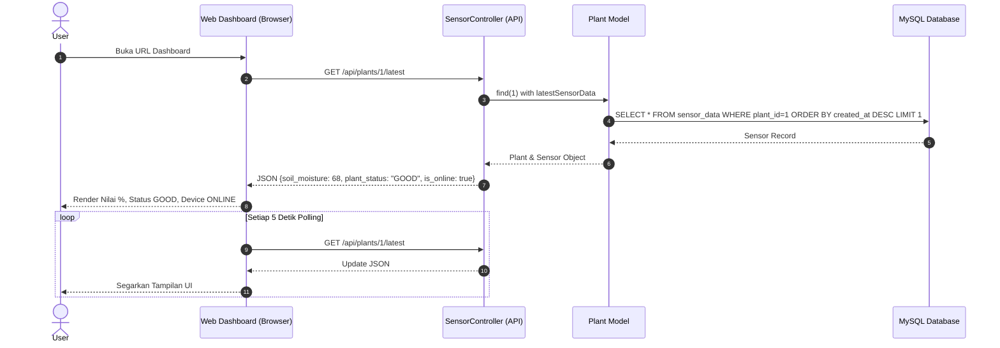
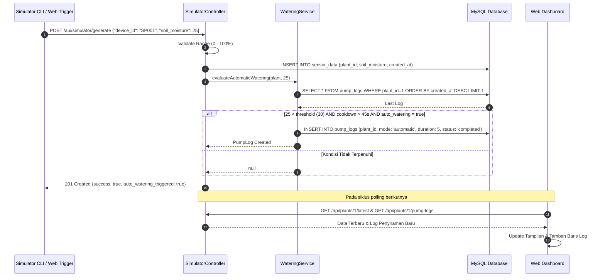

# Sequence Diagram - Smart Plant IoT

Dokumen ini memodelkan interaksi antar objek secara sekuensial berdasarkan waktu.

---

## 1. Sequence Diagram: Monitoring & Realtime Polling

---

## 2. Sequence Diagram: Dummy Sensor Ingestion & Automatic Watering

