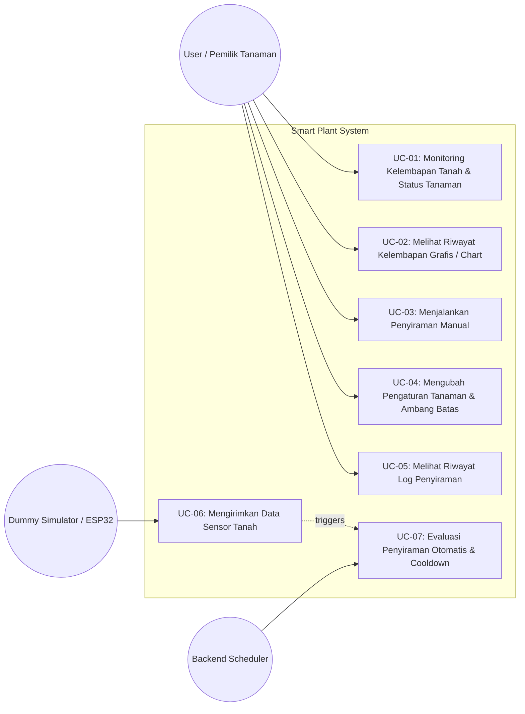

# Use Case Diagram & Specification - Smart Plant IoT

Dokumen ini mendefinisikan Use Case Diagram beserta deskripsi rinci untuk setiap fungsionalitas sistem Smart Plant.

---

## 1. Use Case Diagram

---

## 2. Use Case Specifications

### UC-01: Monitoring Kelembapan Tanah & Status Tanaman
* **Aktor:** User (Pemilik Tanaman)
* **Pre-condition:** Server backend aktif dan database terhubung.
* **Main Flow:**
  1. Pengguna membuka URL dashboard web.
  2. Sistem memuat informasi kelembapan tanah terkini (`%`), status tanaman (`DRY`, `MODERATE`, `GOOD`), status pompa, serta status koneksi alat (`ONLINE`/`OFFLINE`).
  3. Dashboard memperbarui tampilan setiap 5 detik secara otomatis.
* **Post-condition:** Pengguna mengetahui kondisi terkini kelembapan tanah tanaman.

---

### UC-03: Menjalankan Penyiraman Manual (Water Now)
* **Aktor:** User
* **Pre-condition:** Pompa tidak sedang aktif atau dalam masa jeda proteksi (*cooldown*).
* **Main Flow:**
  1. Pengguna menekan tombol "WATER NOW" pada kartu Water Pump di web.
  2. Frontend mengirim permintaan `POST /api/plants/{id}/pump` dengan parameter durasi.
  3. Backend memverifikasi bahwa pompa tidak sedang terkunci (*cooling down*).
  4. Backend mencatat riwayat ke tabel `pump_logs` dengan mode `manual`, durasi 5 detik, dan status `completed`.
  5. Frontend menampilkan countdown timer selama durasi penyiraman dan memperbarui tabel riwayat.
* **Alternative Flow:**
  * Jika tombol ditekan saat pompa masih cooldown (< 10 detik), backend mengembalikan HTTP 429 dan dashboard menampilkan pesan peringatan.

---

### UC-06 & UC-07: Ingestion Data Sensor & Evaluasi Otomatis
* **Aktor:** Dummy Generator / ESP32 & Backend Rule Engine
* **Pre-condition:** Ambang batas (*soil threshold*) dan fitur *automatic watering* aktif.
* **Main Flow:**
  1. Simulator mengirimkan payload `{"device_id": "SP001", "soil_moisture": 25}` ke `POST /api/simulator/generate`.
  2. Backend memvalidasi integritas data (0 - 100%).
  3. Backend menyimpan record ke tabel `sensor_data`.
  4. Backend mengevaluasi:
     * Apakah `automatic_watering == true`? (Ya)
     * Apakah `soil_moisture < threshold` (misal: 25% < 30%)? (Ya)
     * Apakah jeda proteksi (*cooldown* 45 detik) telah terpenuhi? (Ya)
  5. Backend membuat record penyiraman baru di `pump_logs` dengan mode `automatic`.
  6. Backend merespons status sukses dan indikator pemicu otomatisasi.
